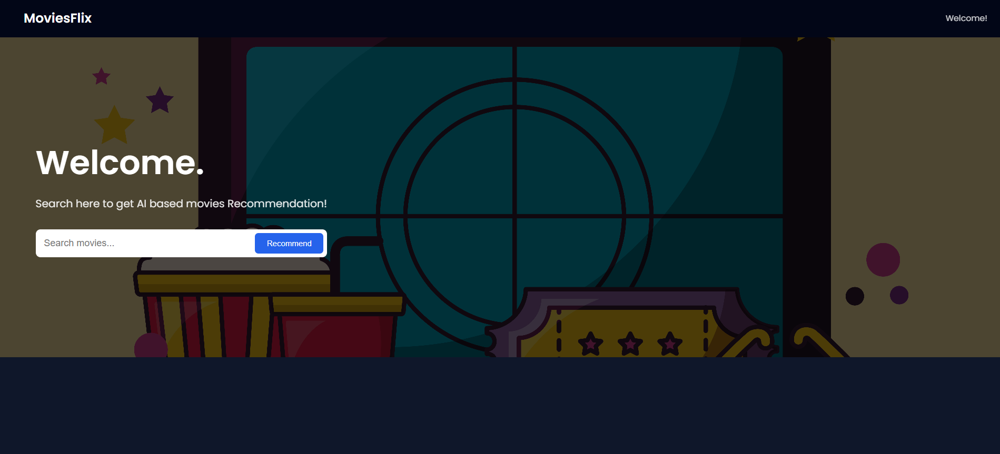
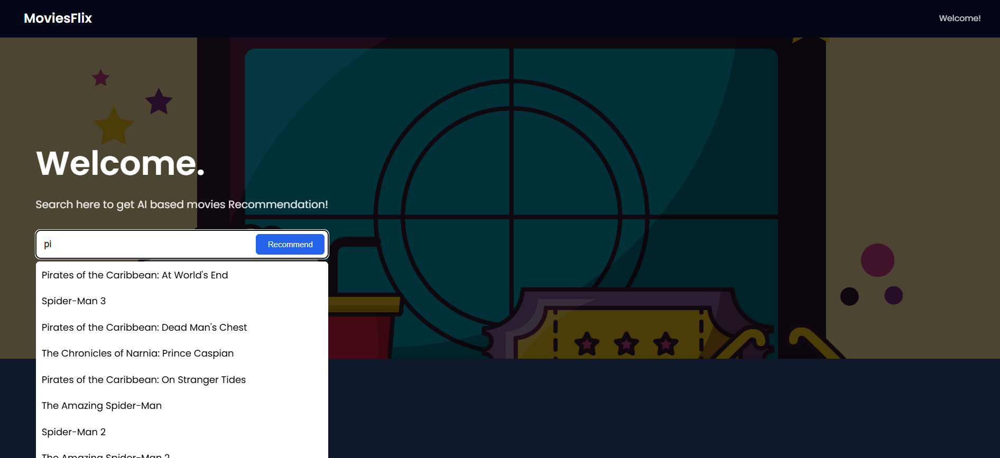
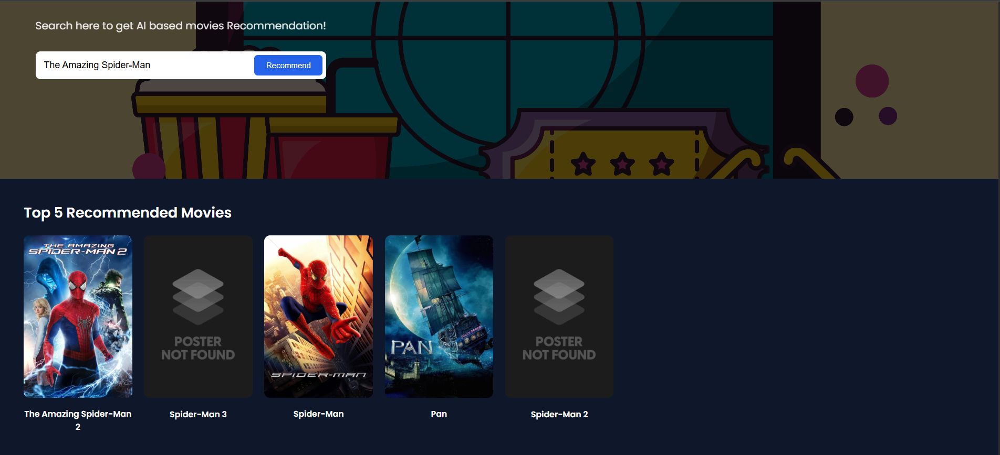

# 🎬 Movie Recommendation System (Flask + Machine Learning)

A **content-based Movie Recommendation System** built using **Machine Learning, Flask, and the TMDB API**.  
The application recommends **Top-5 similar movies** based on a user’s search input and displays **movie posters** using a modern, interactive web interface.

---
🔗 **Live Demo:** [http://ec2-13-234-5-103.ap-south-1.compute.amazonaws.com/](http://ec2-13-234-5-103.ap-south-1.compute.amazonaws.com/)

---

## 🚀 Features

- 🔍 Autocomplete movie search from dataset
- 🎯 Top-5 movie recommendations
- 🧠 Content-based filtering using NLP & cosine similarity
- 🖼️ Movie posters fetched via TMDB API
- ⚡ Precomputed similarity for fast recommendations
- 🎨 Modern Flask frontend

---

## 🧠 How It Works

1. The movie dataset is first cleaned and preprocessed to remove missing and noisy data.
2. Relevant textual features (such as genres, keywords, cast, and overview) are combined into a single text representation.
3. The combined text is transformed into numerical vectors using NLP techniques.
4. Cosine similarity is computed between all movie vectors to measure content similarity.
5. The similarity matrix is saved as a `.pkl` file for fast reuse during inference.
6. When a user searches for a movie, the system finds the most similar movies based on the precomputed similarity scores.
7. The top 5 most similar movies are returned and displayed on the web interface along with their posters.

---

## 🛠️ Tech Stack

- **Backend**: Flask
- **Data Cleaning & Processing**: pandas
- **Machine Learning**: scikit-learn
- **NLP**: NLTK
- **Frontend**: HTML, CSS, JavaScript
- **API**: TMDB API
- **Environment Management**: python-dotenv

---

## ⚠️ Important Note (Please Read)

The **model files (`.pkl`) are NOT included in this repository**.

After cloning the project, you **must run `main.py` first** to generate the required files:

- `movies.pkl`
- `similarity.pkl`

Only after this step should you run the Flask web application.

---

## 🖼️ Web App Screenshots

### 🔹 Home Page

---

### 🔹 Autocomplete Search

---

### 🔹 Recommendations with Posters

---

## 👤 Author

**Subhadip Mudi**  
Machine Learning & Web Development Enthusiast

## ⭐ Support

If you find this project useful or interesting, please consider giving it a ⭐ on GitHub.  
Your support is highly appreciated!
